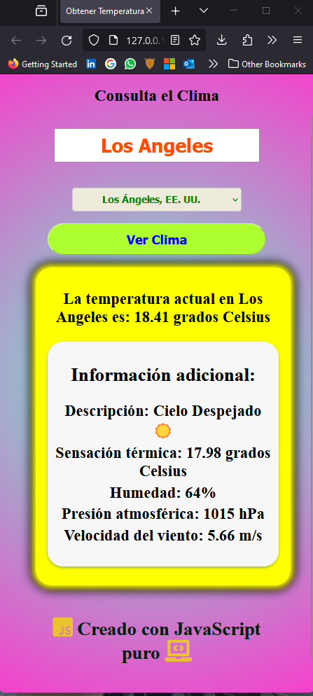
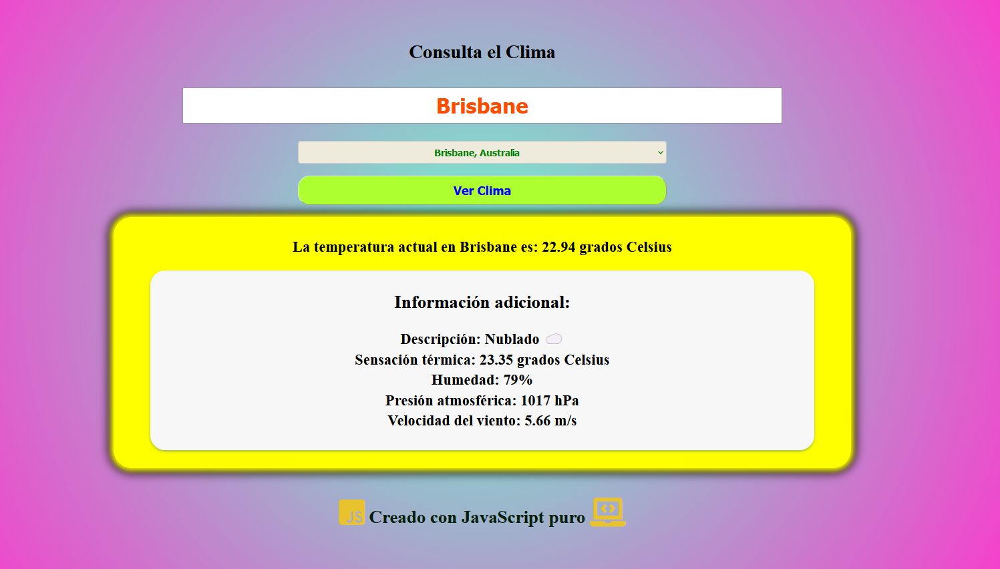
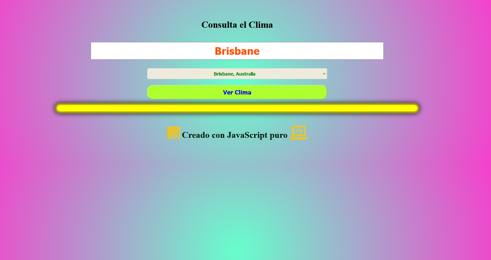
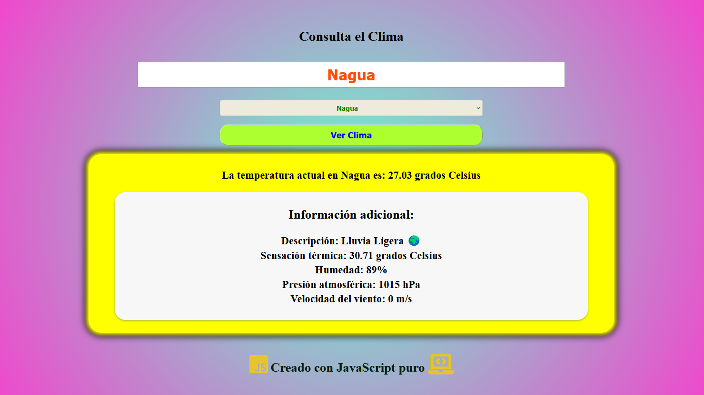

# Aplicacion_del_Clima_V2

# ClimaApp 🌦️

Esta aplicación te permite consultar el clima de diferentes ciudades utilizando la API de OpenWeatherMap. Con una interfaz amigable y diseños responsivos, obtén información meteorológica rápida y precisa.

## Premisa 📝

La premisa de esta aplicación es proporcionar una herramienta fácil de usar para consultar el clima en diversas ciudades. Los usuarios pueden seleccionar una ciudad desde un menú desplegable o escribir el nombre de la ciudad en un campo de texto. Al hacer clic en el botón de búsqueda, la aplicación utiliza la API de OpenWeatherMap para obtener datos meteorológicos detallados.

## Lenguajes y Tecnologías 🖥️

- HTML5 🌐
- CSS3 🎨
- JavaScript 🚀

## Estructura del Proyecto 🏗️

- **HTML**: Contiene la estructura básica de la aplicación.
- **CSS**: Estilos que hacen que la interfaz sea atractiva y adaptable.
- **JavaScript**: Lógica de la aplicación para interactuar con la API y mostrar los datos.

## Detalles Técnicos 🛠️

- La aplicación utiliza la API de OpenWeatherMap para obtener datos meteorológicos como temperatura, descripción del clima, sensación térmica, humedad, presión atmosférica y velocidad del viento.
- Los datos se presentan de manera clara y organizada, brindando una experiencia intuitiva al usuario.
- Se han aplicado estilos responsivos para adaptarse a diferentes dispositivos, manteniendo la consistencia y usabilidad.

## Uso 🚀

1. Selecciona una ciudad desde el menú desplegable o escribe el nombre de la ciudad en el campo de texto.
2. Haz clic en el botón de búsqueda para obtener la información meteorológica.
3. Observa los datos presentados de manera clara y legible.

## Capturas de Pantalla 📸








## Agradecimientos 🙌

La aplicación utiliza la API de OpenWeatherMap, agradecemos su servicio y apoyo.

## Clonar o Descargar 🚀

Puedes clonar este repositorio ejecutando el siguiente comando en tu terminal:

```bash
git clone https://github.com/JUANCITOPENA/Aplicacion_del_Clima_V2
---

## Licencia 📝

Este proyecto está bajo la Licencia MIT.

¡Gracias por utilizar ClimaApp! Siéntete libre de contribuir, informar errores o mejorar esta aplicación. 🌟
